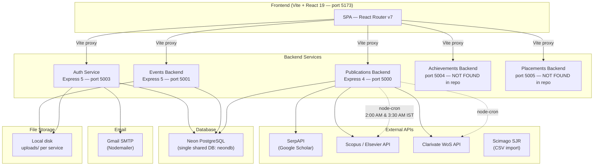

# PART 00 — OVERVIEW

## What the Product Is

**G-Portal** (internally "G-Learn") is a university faculty/student management platform built for **GITAM University**. It centralises academic record-keeping across five modules: Events, Publications, Achievements, Placements, and user administration.

**Problem it solves:** Faculty and administrators at GITAM needed a single portal to track professional events, research publications (with automated syncing from Scopus, Web of Science, Google Scholar), student achievements, and placement experiences — replacing fragmented spreadsheets and manual reporting.

### Roles

| Role | Description |
|------|------------|
| **admin** | Full access: user CRUD (bulk + single), all module dashboards, flag/dispute publications, upload KRC/Scimago CSVs, trigger syncs, view analytics across all faculty |
| **faculty** | Events CRUD with calendar heatmap and memories, publications/conferences/books management, profile editing, achievement viewing (mentored students), placements viewing |
| **student** | Submit and view own achievements, submit and browse placement experiences, limited profile |

---

## Modules / Features per Role

### Admin
- User management (create single/bulk, activate/deactivate, delete, search/filter)
- Events: admin dashboard, explorer (all faculty events), faculty list view
- Publications: overview analytics, faculty directory, publications/conferences/books explorer, upload data (KRC CSV, Scimago CSV, backfill quartiles)
- Achievements: admin dashboard (all achievements across students/faculty)
- Placements: analytics dashboard

### Faculty
- Events: dashboard with heatmap calendar + memories, event CRUD, CSV bulk import, profile, export
- Publications: dashboard with citation metrics, publications/conferences/books CRUD, Scopus/WoS/Scholar sync, flag history, KRC view, edit profile (URLs)
- Achievements: view mentored students' achievements, submit own achievements
- Placements: browse, submit experiences, view analytics

### Student
- Achievements: submit, view own achievements
- Placements: browse companies, submit experiences, view analytics, upvote/bookmark

---

## High-Level Architecture



> **Note:** The Achievements backend (port 5004) and Placements backend (port 5005) are referenced in the Vite proxy config but their source code is **NOT FOUND** in this repository. Only the frontend modules for these exist.

---

## Services

| Service | Port | Purpose | Entry File | Communication |
|---------|------|---------|------------|---------------|
| **Frontend** | 5173 | React SPA | `frontend/src/main.tsx` | Vite dev proxy to backends |
| **Auth Service** | 5003 | User auth, OTP, Google OAuth, admin user CRUD, profile/onboarding | `auth-service/src/server.js` | REST JSON over HTTP |
| **Events Backend** | 5001 (env default 5000) | Faculty events CRUD, CSV bulk import, file uploads, admin explorer | `events-backend/src/server.js` | REST JSON over HTTP |
| **Publications Backend** | 5000 | Publications/conferences/books CRUD, Scopus/WoS/Scholar sync, flags, KRC, journal rankings, admin stats | `publications-backend/src/server.js` | REST JSON over HTTP |
| **Achievements Backend** | 5004 | Achievements CRUD, exports | NOT FOUND in repo | Proxied from frontend |
| **Placements Backend** | 5005 | Companies, submissions, analytics | NOT FOUND in repo | Proxied from frontend |

All backend services share the **same Neon PostgreSQL database** (`neondb`) via `DATABASE_URL` env variable. Communication between services is indirect (they share a DB but don't call each other).

---

## Repo Tree (3 Levels Deep)

```
G-Learn/
├── .gitignore                    # Root gitignore
├── hash.js                       # bcrypt hash utility script
├── package.json                  # Root package: bcryptjs, google-auth-library, nodemailer
├── package-lock.json
│
├── auth-service/                 # Auth + user management microservice
│   ├── .env                      # DB, JWT, Gmail, Google OAuth config
│   ├── package.json              # Express 5, bcryptjs, pg, multer, nodemailer
│   ├── create-admin.js           # Admin user seed script
│   ├── list-tables.js            # DB schema introspection script
│   ├── test-auth.html            # Standalone auth test page
│   ├── uploads/                  # Profile photo storage (disk)
│   └── src/
│       ├── server.js
│       ├── config/database.js
│       ├── controllers/          # authController, adminController, googleController, otpController, passwordController, profileController
│       ├── middleware/            # authMiddleware (protect + requireAdmin)
│       ├── routes/               # authRoutes, adminRoutes, profileRoutes
│       └── utils/                # emailService, jwtUtils, otpUtils
│
├── events-backend/               # Events CRUD + admin explorer
│   ├── .env                      # DB config, JWT secret, frontend URL
│   ├── package.json              # Express 5, multer, fast-csv, exceljs, pg
│   ├── uploads/                  # Event certificates and photos (disk)
│   └── src/
│       ├── server.js
│       ├── config/database.js
│       ├── controllers/          # authController, eventController, facultyController
│       ├── middleware/            # authMiddleware, roleMiddleware, uploadMiddleware
│       └── routes/               # authRoutes, eventRoutes, facultyRoutes, exportRoutes
│
├── publications-backend/         # Publications + external syncs
│   ├── .env                      # DB, JWT, Scopus API key, SerpAPI key, Cloudinary
│   ├── package.json              # Express 4, node-cron, xlsx, cloudinary, pg
│   ├── scripts/                  # Empty
│   ├── test-login.html           # Standalone login test page
│   ├── test_delete.js            # Deletion test script
│   ├── uploads/                  # File uploads (disk)
│   └── src/
│       ├── server.js             # Cron jobs: Scopus 2 AM, WoS 3:30 AM IST
│       ├── config/database.js
│       ├── controllers/          # 13 controllers (auth, publication, conference, book, flag, scopus, wos, scholar, krc, journalRankings, potentialFlag, adminStats, scholarMetrics)
│       ├── middleware/            # authMiddleware (protect + adminOnly)
│       ├── routes/               # 12 route files
│       ├── scripts/              # backfillAuthorPosition.js
│       └── utils/                # authorPosition.js
│
└── frontend/                     # React SPA
    ├── .env, .env.development, .env.production
    ├── package.json              # React 19, Tailwind 4, Vite 8, shadcn/ui primitives
    ├── vite.config.ts            # Dev proxy: 18 proxy rules routing to 4 backends
    ├── tsconfig.app.json         # verbatimModuleSyntax, es2023 target
    ├── eslint.config.js          # typescript-eslint + react-hooks + react-refresh
    ├── index.html                # Plus Jakarta Sans + JetBrains Mono fonts
    └── src/
        ├── App.tsx               # 44 routes, BrowserRouter, AuthProvider, Toaster
        ├── main.tsx              # GoogleOAuthProvider wrapping App
        ├── index.css             # Tailwind v4 @theme tokens + custom scrollbar utilities
        ├── App.css               # Additional styles
        ├── api/                  # axios instances: authAxios, eventsAxios, publicationsAxios, adminApi, authApi
        ├── assets/               # Static assets
        ├── components/           # Navbar, ProtectedRoute
        ├── context/              # AuthContext (single context for the whole app)
        ├── lib/                  # utils.ts (cn helper)
        ├── types/                # Root User, TokenPayload, AuthContextType, AuthResponse, ApiError
        ├── pages/                # 8 platform pages: Login, FirstLogin, VerifyOTP, ForgotPassword, ResetPassword, Onboarding, Home, AdminUsers
        └── modules/
            ├── events/           # api/, assets/, components/, lib/, pages/(admin + faculty), types/, utils/
            ├── publications/     # api/, components/ (18 + 26 ui), pages/(admin + faculty), types/, utils/
            ├── achievements/     # api/, components/ (4), pages/(admin, faculty, shared, student), types/, utils/
            └── placements/       # components/(analytics, ui), layouts/, lib/, pages/ (7 pages in JSX)
```

---

## Tech Stack (Exact Versions from package.json)

### Frontend (`frontend/package.json`)

| Technology | Version | Purpose |
|-----------|---------|---------|
| React | ^19.2.7 | UI framework |
| React DOM | ^19.2.7 | DOM renderer |
| React Router DOM | ^7.18.1 | Client-side routing |
| Vite | ^8.1.1 | Build tool / dev server |
| TypeScript | ~6.0.2 | Type checking |
| Tailwind CSS | ^4.3.2 | Utility-first CSS |
| @tailwindcss/vite | ^4.3.2 | Tailwind Vite plugin |
| @vitejs/plugin-react | ^6.0.3 | React Fast Refresh for Vite |
| Axios | ^1.18.1 | HTTP client |
| Framer Motion | ^12.42.2 | Animations |
| Chart.js | ^4.5.1 | Charts (UNCERTAIN if used — Recharts also present) |
| Recharts | ^3.9.1 | React chart library |
| Sonner | ^2.0.7 | Toast notifications |
| React Hook Form | ^7.81.0 | Form management |
| Lucide React | ^1.23.0 | Icon library |
| next-themes | ^0.4.6 | Dark mode support |
| @react-oauth/google | ^0.13.5 | Google OAuth |
| class-variance-authority | ^0.7.1 | Component variant utility (shadcn) |
| clsx | ^2.1.1 | Class name utility |
| tailwind-merge | ^3.6.0 | Tailwind class deduplication |
| react-resizable-panels | ^4.12.1 | Resizable panel layout |
| 16 @radix-ui/* packages | various | shadcn/ui primitives (dialog, select, tabs, popover, etc.) |

**ESLint:** ^10.6.0 with typescript-eslint ^8.62.0, react-hooks ^7.1.1, react-refresh ^0.5.3

### Auth Service (`auth-service/package.json`)

| Technology | Version |
|-----------|---------|
| Express | ^5.2.1 |
| bcryptjs | ^3.0.3 |
| jsonwebtoken | ^9.0.3 |
| pg | ^8.22.0 |
| multer | ^2.2.0 |
| nodemailer | ^9.0.3 |
| dotenv | ^17.4.2 |
| cors | ^2.8.6 |
| google-auth-library | ^10.9.0 |
| nodemon (dev) | ^3.1.14 |

### Events Backend (`events-backend/package.json`)

| Technology | Version |
|-----------|---------|
| Express | ^5.2.1 |
| bcryptjs | ^3.0.3 |
| jsonwebtoken | ^9.0.3 |
| pg | ^8.22.0 |
| multer | ^2.2.0 |
| fast-csv | ^5.0.7 |
| exceljs | ^4.4.0 |
| dotenv | ^17.4.2 |
| cors | ^2.8.6 |
| nodemon (dev) | ^3.1.14 |

### Publications Backend (`publications-backend/package.json`)

| Technology | Version | Note |
|-----------|---------|------|
| Express | ^4.21.2 | Older than auth/events (v4 vs v5) |
| bcryptjs | ^2.4.3 | Older version than auth-service |
| jsonwebtoken | ^9.0.2 | |
| pg | ^8.13.1 | Older pg version |
| multer | ^1.4.5-lts.1 | Older multer |
| node-cron | ^4.2.1 | Nightly Scopus/WoS sync scheduling |
| cloudinary | ^2.5.1 | Cloud file storage (for publication files) |
| xlsx | ^0.18.5 | Excel file parsing |
| dotenv | ^16.4.7 | |
| cors | ^2.8.5 | |
| nodemon (dev) | ^3.1.9 | |

### Runtime / Package Manager / Hosting

| Item | Value |
|------|-------|
| Node.js | UNCERTAIN — no `.nvmrc` or `engines` field found |
| Package manager | npm (all services use `package-lock.json`) |
| Module system | CommonJS for all backends (`"type": "commonjs"`), ESM for frontend (`"type": "module"`) |
| Database hosting | **Neon PostgreSQL** (cloud, ap-southeast-1 AWS region) |
| App hosting | UNCERTAIN — no Vercel/Netlify/Docker config found. Likely local dev only at this stage |

### Environment Variables (Names Only)

**Auth Service:** `DATABASE_URL`, `JWT_SECRET`, `JWT_EXPIRES_IN`, `PORT`, `GMAIL_USER`, `GMAIL_APP_PASSWORD`, `GOOGLE_CLIENT_ID`, `ADMIN_EMAILS`, `DEV_MODE`

**Events Backend:** `DATABASE_URL`, `JWT_SECRET`, `PORT`, `FRONTEND_URL`

**Publications Backend:** `DATABASE_URL`, `JWT_SECRET`, `PORT`, `NODE_ENV`, `SCOPUS_API_KEY`, `SERPAPI_KEY`, `CLOUDINARY_CLOUD_NAME`, `CLOUDINARY_API_KEY`, `CLOUDINARY_API_SECRET`

**Frontend:** `VITE_AUTH_URL`, `VITE_PUBLICATIONS_URL`, `VITE_EVENTS_URL`, `VITE_AUTH_ORIGIN`, `VITE_EVENTS_ORIGIN`, `VITE_PUBLICATIONS_ORIGIN`, `VITE_GOOGLE_CLIENT_ID`
