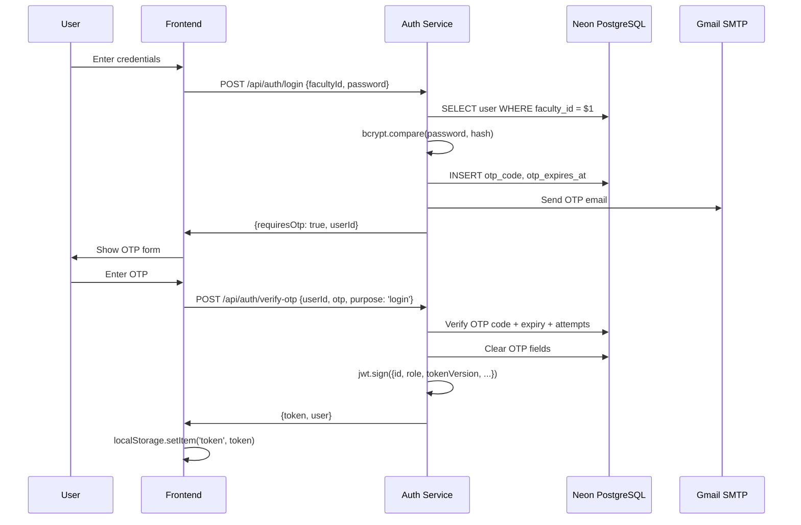
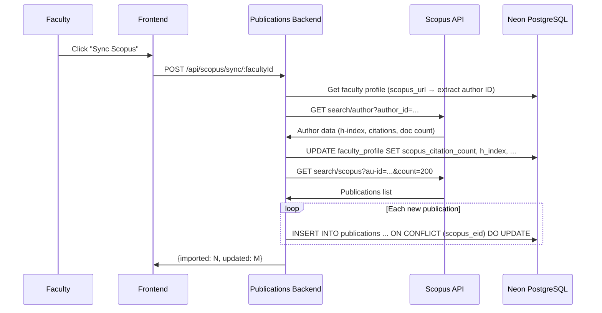

# PART 04 — DATABASE & DATA MODEL

## Database Provider

- **Provider:** Neon PostgreSQL (serverless Postgres)
- **Region:** `ap-southeast-1` (AWS Singapore)
- **Database:** `neondb` (single shared database for all services)
- **Connection:** All three backend services connect via `DATABASE_URL` env variable using `pg.Pool`
- **SSL:** `ssl: { rejectUnauthorized: false }` in all services
- **Pooling:** Neon's connection pooler (`-pooler` endpoint in connection string)

**Critical finding:** All services share the same database, which means:
- Auth, Events, and Publications backends all read/write the `users` table
- JWT validation in each service independently queries the shared `users` table
- No inter-service API calls are needed for auth — each service validates tokens directly

---

## Connection Configuration

### Auth Service (`auth-service/src/config/database.js`)
```javascript
const pool = new Pool({
    connectionString: process.env.DATABASE_URL,
    ssl: { rejectUnauthorized: false }
});
pool.on('connect', () => console.log('✅ Auth Service connected to G-Learn (Neon PostgreSQL)'));
pool.on('error', (err) => { console.error('❌ ...', err); process.exit(-1); });
```

### Events Backend (`events-backend/src/config/database.js`)
```javascript
const pool = new Pool({
    connectionString: process.env.DATABASE_URL,
    ssl: { rejectUnauthorized: false }
});
```
Minimal config — no event listeners.

### Publications Backend (`publications-backend/src/config/database.js`)
Same as auth-service with connect/error listeners.

---

## Schema (Inferred from Code)

> **Note:** There are NO migration files in this repository. The schema is inferred from SQL queries in controllers. A `list-tables.js` script exists in `auth-service/` that dumps all tables, columns, foreign keys, and row counts from the live database.

### `users` Table

**Referenced in:** auth-service, events-backend, publications-backend (all three)

| Column | Type | Nullable | Default | Notes |
|--------|------|----------|---------|-------|
| `id` | SERIAL / INTEGER | NOT NULL | auto-increment | Primary key |
| `faculty_id` | VARCHAR | NOT NULL | — | Unique identifier (faculty ID or student reg number) |
| `name` | VARCHAR | NOT NULL | — | |
| `email` | VARCHAR | NOT NULL | — | Unique, stored lowercase |
| `password` | VARCHAR | NOT NULL | — | bcrypt hash |
| `role` | VARCHAR | NOT NULL | — | 'faculty', 'student', 'admin' |
| `department` | VARCHAR | NULL | — | |
| `designation` | VARCHAR | NULL | — | Faculty only |
| `mobile` | VARCHAR | NULL | — | |
| `is_active` | BOOLEAN | NOT NULL | true | |
| `first_login` | BOOLEAN | NOT NULL | true | Set false after first password setup |
| `profile_completed` | BOOLEAN | NOT NULL | false | Set true after onboarding |
| `token_version` | INTEGER | NOT NULL | 0 | Incremented to invalidate all JWTs |
| `google_id` | VARCHAR | NULL | — | Google OAuth sub ID |
| `google_linked_at` | TIMESTAMP | NULL | — | |
| `otp_code` | VARCHAR | NULL | — | Current 6-digit OTP |
| `otp_expires_at` | TIMESTAMP | NULL | — | OTP expiry (10 min) |
| `otp_attempts` | INTEGER | NOT NULL | 0 | Wrong attempts counter |
| `otp_locked_until` | TIMESTAMP | NULL | — | Lockout time (15 min after 3 failures) |
| `otp_requests_count` | INTEGER | NOT NULL | 0 | Hourly rate limit counter |
| `otp_requests_reset_at` | TIMESTAMP | NULL | — | Rate limit window end |
| `password_reset_count` | INTEGER | NULL | — | Daily password reset counter |
| `password_reset_reset_at` | TIMESTAMP | NULL | — | Daily reset window |
| `created_at` | TIMESTAMP | NOT NULL | NOW() | |
| `updated_at` | TIMESTAMP | NOT NULL | NOW() | |

### `faculty_profile` Table

**Referenced in:** auth-service, publications-backend

| Column | Type | Nullable | Notes |
|--------|------|----------|-------|
| `id` | SERIAL | NOT NULL | Primary key |
| `user_id` | INTEGER | NOT NULL | FK → users.id |
| `research_area` | TEXT | NULL | Comma-separated string |
| `courses_taught` | TEXT | NULL | Comma-separated string |
| `roles` | TEXT | NULL | Comma-separated string |
| `office_room` | VARCHAR | NULL | |
| `office_hours` | VARCHAR | NULL | |
| `years_of_experience` | INTEGER | NULL | |
| `profile_photo` | TEXT | NULL | URL or path |
| `profile_setup_complete` | BOOLEAN | NOT NULL | |
| `google_scholar_url` | TEXT | NULL | |
| `scopus_url` | TEXT | NULL | Primary Scopus URL |
| `scopus_url_2` | TEXT | NULL | Additional Scopus URL |
| `scopus_url_3` | TEXT | NULL | Additional Scopus URL |
| `wos_url` | TEXT | NULL | Primary WoS URL |
| `wos_url_2` | TEXT | NULL | Additional WoS URL |
| `wos_url_3` | TEXT | NULL | Additional WoS URL |
| `linkedin_url` | TEXT | NULL | |
| `website_url` | TEXT | NULL | |
| `scopus_author_id` | VARCHAR | NULL | Extracted from Scopus URL |
| `scopus_citation_count` | INTEGER | NULL | Author-level citation count |
| `scopus_h_index` | INTEGER | NULL | |
| `scopus_document_count` | INTEGER | NULL | |
| `scopus_last_synced` | TIMESTAMP | NULL | |
| `wos_researcher_id` | VARCHAR | NULL | |
| `wos_citation_count` | INTEGER | NULL | |
| `wos_h_index` | INTEGER | NULL | |
| `wos_document_count` | INTEGER | NULL | |
| `wos_last_synced` | TIMESTAMP | NULL | |
| `scholar_citation_count` | INTEGER | NULL | |
| `scholar_h_index` | INTEGER | NULL | |
| `scholar_i10_index` | INTEGER | NULL | |
| `scholar_last_synced` | TIMESTAMP | NULL | |
| `updated_at` | TIMESTAMP | NULL | |

### `events` Table

**Referenced in:** events-backend

| Column | Type | Nullable | Notes |
|--------|------|----------|-------|
| `id` | SERIAL | NOT NULL | PK |
| `faculty_id` | INTEGER | NOT NULL | FK → users.id |
| `event_title` | VARCHAR | NOT NULL | |
| `event_type` | VARCHAR | NOT NULL | Enum values in app layer |
| `role_at_event` | VARCHAR | NOT NULL | |
| `level` | VARCHAR | NOT NULL | |
| `organizer` | VARCHAR | NOT NULL | |
| `venue` | VARCHAR | NULL | |
| `mode` | VARCHAR | NOT NULL | Online/Offline/Hybrid |
| `start_date` | DATE | NOT NULL | |
| `end_date` | DATE | NOT NULL | |
| `description` | TEXT | NULL | |
| `certificate_urls` | TEXT[] / JSONB | NULL | Array of file paths |
| `photo_urls` | TEXT[] / JSONB | NULL | Array of file paths |
| `status` | VARCHAR | NOT NULL | 'draft' or 'submitted' |
| `docs_status` | VARCHAR | NULL | pending_both, pending_cert, pending_photo, complete |
| `document_deadline` | TIMESTAMP | NULL | Auto-delete if passed |
| `import_batch_id` | VARCHAR | NULL | Links to CSV import batch |
| `created_at` | TIMESTAMP | NOT NULL | |
| `updated_at` | TIMESTAMP | NOT NULL | |

### `publications` Table

**Referenced in:** publications-backend

| Column | Type | Nullable | Notes |
|--------|------|----------|-------|
| `id` | SERIAL | NOT NULL | PK |
| `faculty_id` | INTEGER / VARCHAR | NOT NULL | References faculty |
| `title` | TEXT | NOT NULL | |
| `journal` | VARCHAR | NOT NULL | |
| `quartile` | VARCHAR | NULL | Q1/Q2/Q3/Q4 |
| `impact_factor` | NUMERIC | NULL | |
| `sjr_score` | NUMERIC | NULL | |
| `cite_score` | NUMERIC | NULL | |
| `wos_citations` | INTEGER | NOT NULL | Default 0 |
| `scopus_citations` | INTEGER | NOT NULL | Default 0 |
| `google_citations` | INTEGER | NOT NULL | Default 0 |
| `authors` | TEXT[] | NULL | |
| `indexing` | VARCHAR | NULL | |
| `source` | VARCHAR | NULL | 'manual', 'scopus', 'wos', 'scholar' |
| `area_of_paper` | TEXT | NULL | |
| `position_of_author` | VARCHAR | NULL | |
| `volume` | VARCHAR | NULL | |
| `issue` | VARCHAR | NULL | |
| `start_page` | VARCHAR | NULL | |
| `last_page` | VARCHAR | NULL | |
| `month_year` | VARCHAR | NULL | |
| `academic_year` | VARCHAR | NULL | |
| `doi` | VARCHAR | NULL | |
| `link` | TEXT | NULL | |
| `apa_format` | TEXT | NULL | |
| `file_data` | TEXT | NULL | |
| `file_url` | TEXT | NULL | |
| `file_name` | VARCHAR | NULL | |
| `file_type` | VARCHAR | NULL | |
| `last_edited_by` | VARCHAR | NULL | |
| `last_edited_at` | TIMESTAMP | NULL | |
| `scopus_eid` | VARCHAR | NULL | Scopus unique EID |
| `wos_uid` | VARCHAR | NULL | WoS unique UID |
| `created_at` | TIMESTAMP | NOT NULL | |
| `updated_at` | TIMESTAMP | NOT NULL | |

### `conferences` Table

Similar structure to publications with: title, conference_name, type (International/National), venue, country, month, year, academic_year, authors[], doi, link, apa_format, file fields, faculty_id.

### `books` Table

Similar structure: title, type (Book/Book Chapter), publisher, isbn, year, academic_year, authors[], doi, link, apa_format, file fields, faculty_id.

### `flags` Table

| Column | Type | Nullable | Notes |
|--------|------|----------|-------|
| `id` | SERIAL | NOT NULL | PK |
| `item_type` | VARCHAR | NOT NULL | 'publication', 'conference', 'book' |
| `item_id` | INTEGER | NOT NULL | FK to respective table |
| `faculty_id` | INTEGER | NOT NULL | |
| `reason` | TEXT | NOT NULL | Admin's flag reason |
| `message` | TEXT | NULL | Faculty's resolution message |
| `status` | VARCHAR | NOT NULL | 'flagged', 'pending_review', 'resolved' |
| `flagged_by` | INTEGER | NULL | Admin user ID |
| `flagged_by_name` | VARCHAR | NULL | |
| `created_at` | TIMESTAMP | NOT NULL | |
| `updated_at` | TIMESTAMP | NOT NULL | |

### `flag_history` Table

| Column | Type | Nullable | Notes |
|--------|------|----------|-------|
| `id` | SERIAL | NOT NULL | PK |
| `flag_id` | INTEGER | NOT NULL | FK → flags.id |
| `reflagged_at` | TIMESTAMP | NOT NULL | |
| (other fields) | | | UNCERTAIN — queried but not fully defined in code |

### `potential_flags` Table

| Column | Type | Nullable | Notes |
|--------|------|----------|-------|
| `id` | SERIAL | NOT NULL | PK |
| `publication_id` | INTEGER | NOT NULL | |
| `faculty_id` | INTEGER | NOT NULL | |
| `missing_fields` | TEXT[] | NOT NULL | Array of missing field names |
| `status` | VARCHAR | NOT NULL | 'active', 'resolved', etc. |
| `created_at` | TIMESTAMP | NOT NULL | |

### `journal_rankings` Table (Scimago data)

Referenced in `journalRankingsController.js`. Stores Scimago SJR journal ranking data imported via CSV.

### `krc_data` Table

Referenced in `krcController.js`. Stores Key Result Contribution data imported via CSV.

### `pl_user_sessions` Table

Referenced in `otpController.js` (fire-and-forget INSERT):
```javascript
pool.query('INSERT INTO pl_user_sessions (user_id) VALUES ($1)', [user.id])
```

### Other Tables (UNCERTAIN)

The `list-tables.js` script queries all tables in the public schema but doesn't hardcode any names. The actual table list would be revealed by running the script. Based on code references, there are likely additional tables for:
- Achievement data (for the missing achievements backend)
- Placement-related data (companies, submissions, comments, analytics)
- Scholar yearly citation data

---

## Migrations / Schema Management

**NOT FOUND.** There are:
- No migration files (no Knex, Prisma, Sequelize, or raw SQL migration directories)
- No ORM (all queries use raw `pool.query()` with parameterized SQL)
- No `schema.sql` or `init.sql` files
- No `CREATE TABLE` statements anywhere in the codebase

**The schema is managed entirely out-of-band** — likely created directly in the Neon database console or via manual SQL. This is a significant risk for:
- Schema drift between environments
- Missing documentation of column types and constraints
- No ability to reproduce the database from the codebase alone

The `list-tables.js` script in `auth-service/` is the closest thing to schema documentation. It connects to the live database and dumps the schema using `information_schema` queries. **Note:** This script contains a **hardcoded database connection string with credentials** in the source code.

---

## Indexes, Constraints, and Triggers

**NOT FOUND** in application code. All constraint enforcement appears to be:
- Application-level uniqueness checks (e.g., `SELECT ... WHERE faculty_id = $1 OR email = $2` before INSERT)
- Application-level foreign key awareness (manual DELETE from `faculty_profile` before DELETE from `users`)
- No evidence of database-level triggers for any auto-cleanup (e.g., event auto-deletion is likely handled by the application, not DB triggers)

---

## Data Flow Diagrams

### Authentication Flow


### Publication Sync Flow (Scopus)

